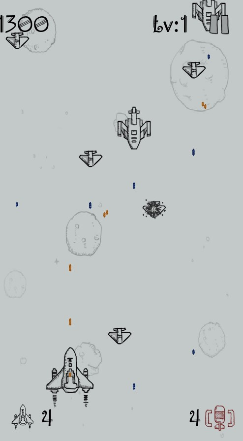
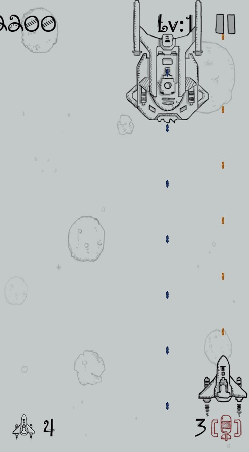

# 飞机大战
### 基于pygame库，四天完成的一个小作品，用来交期末作业，素材来源于网络。

### 管理器部分：
学习了Ellan大大的GameFramework框架，已经熟悉了这种MoM模式，于是自己实现了一套简易的MoM框架，具有：

#### 0.入口：
静态类，初始化所有管理器，用于调用，以及每帧轮询管理器。这个写法和GameFramework的示范是一样的，不把每个管理器都作为单例，而是通过统一的管理器来调用和管理所有管理器。

#### 1.资源管理器：
其实就是字典防止重复加载资源浪费内存。

#### 2.数据管理器：
分为默认配置数据（图方便抽离出来作为一个静态类调用），运行时数据，用户数据。

#### 3.事件管理器：
基于pygame.time.set_timer，可以抛出和终止事件抛出/循环，可以注册和取消注册事件到对应事件字典，轮询字典，在事件触发时调用所有注册的方法。

#### 4.实体管理器：
内含简单对象池，每种实体（类型为枚举，具体的实体类继承自Sprite），需要show新实体时若池中已有实体则取出，否则生成枚举对应的实体。
生成时通过枚举查询默认配置中的实体字典和实体数据字典，用实体数据初始化实体类，理论上可以通过写配置产生不同组合的实体。

生成的实体会放入配置对应的碰撞组中，每帧轮询。在一定条件下回收到对象池。

#### 5.UI管理器：
和实体管理器一样采用枚举+配置，UI类，UI数据类来生成UI。

UI数据为一个控件列表，控件现在有图片、按钮、文本，每个控件有对应控件类的枚举、控件位置、额外信息字典三个值。
生成的控件放在对应位置，遍历额外信息字典，如图片有“image”属性，指定图片，文本有“Text”属性。
按钮继承自图片，并且有onClick，onPointEnter，onPointLeave三个Action，Action类继承自list，可以添加删除方法，Invoke轮询所有方法。也可以添加“text”属性在按钮中央生成Text控件。
通过这些属性，填写配置就能很快的生成需要的界面。

仅具有打开UI功能，每次打开会关闭上一个UI，不支持多UI，因为基于我之前项目的体验，多层UI的管理实在是灾难，需要实现的功能很多，小项目不打算整的太复杂。
没有多UI，数量也少，UI的对象池管理也就没什么必要，初始化时全部生成存字典里。

#### 6.输入管理器：
非常简单，就每帧调pygame.key.get_pressed，将要用的按键结果存着给player读。

#### 7.关卡管理器：
负责游戏中状态的管理，相应的界面跳转，以及生成玩家和敌人，还有补给。敌人的生成通过读取配置表中对应关卡的“敌人乐谱”字典生成，key是生成时间，value是生成类型和位置，没有做关卡设计，配置表里都是填的随机。

### 其他部分：
#### 子弹：
同样有子弹乐谱，列表填属性和值，如sleep属性是在这个乐谱循环中下次射击间隔时间。
而且有我最早想实现的一个功能，通过python的装饰器，动态生成发射子弹函数，属性double可以发射两次，offset偏移子弹，circle属性有两个参数，可以环形复制子弹。

而且这些装饰属性是可以叠加的，最后通过编写子弹乐谱，就能实现东方那种花里胡哨的满屏弹幕效果。
可惜现在这套对象有bug，还是没搞懂python的装饰器用法，在简单测试中成功了，但在实战失败了，可能以后有机会回来修改。
#### 补给：
由于时间关系，还只能补炸弹，定时掉落，打算让敌人也可以掉落，并且随机给不同补给，比如恢复生命值。
还有暂时废弃的子弹乐谱应该就是通过吃补给，每次重新生成发射子弹函数，在rundata中的bufflist就是给这个功能准备的。

### 总结：
第二次使用python做东西，上一个是pyqt实现的小词典，不得不说python做东西很快。

项目比较大的坑是python的循环import，导致最开始的项目结构完全用不了。

中间还整了很多test来熟悉python的语法特性，作为一个解释型语言，python的这些特性有的很方便，有的真的很坑，不过总的来说，python可以快速的做很多小东西。
#
